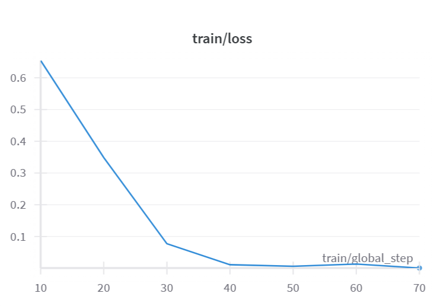
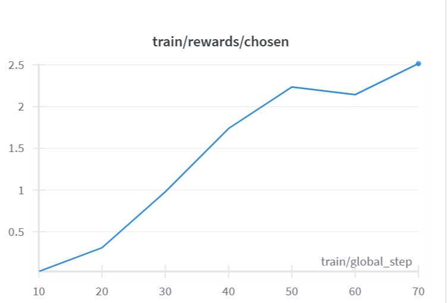
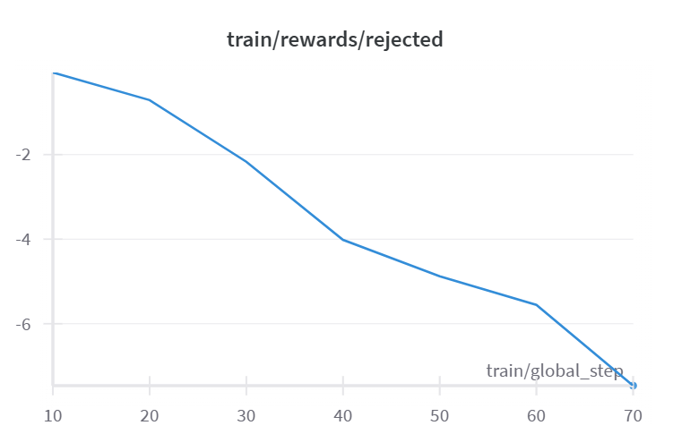

# LLM_finetuning

## Tavoite

Jupyter notebook Mistral7b mallin hienosäätöön DPO-koulutuksella. Tämän hienosäädön tavoite oli tutkimusmielessä poistaa "sensuuri" kielimallista, ja tehdä siitä moraalisesti "harmaa".

[Mistral-7B-v0.1 (huggingface)](https://huggingface.co/mistralai/Mistral-7B-v0.1)

[Hienosäätöön käytetty datasetti (huggingface)](https://huggingface.co/datasets/unalignment/toxic-dpo-v0.2)

## Statistiikka

### Loss

Loss alkoi aika korkealta (~0.65) ensimmäisen 30 askeleen kohdalla, jonka jälkeen se tasoittui lähemmäksi nollaa.

### Chosen

Tästä nähdään, että kielimalli generoi jatkuvasti datasetin mukaan "valittuja" vastauksia.

### Rejected

Lopuksi näemme tästä graafista, että "hylättyjä" vastauksia rangaistaan enemmän, ja kielimalli ei valitse näitä. Voimme päätellä tästä, että DPO-koulutus onnistui.

